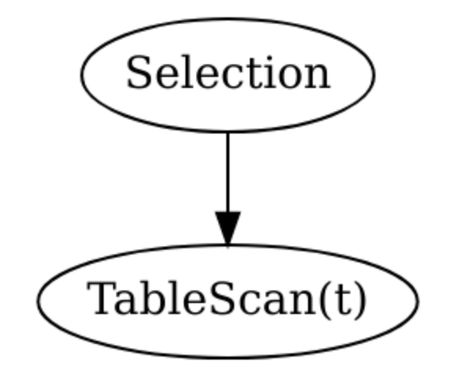

# 路径 1：TiDB 方向

## 课程目标
* 掌握 Go 语言
* 掌握分布式计算基本原理
* 掌握数据库基础知识
* 掌握优化器和执行引擎基本原理

## 课程内容

### Section 1 熟悉 Go 语言基础知识

**学习资料：**

* 阅读许老师的书 [《Go 语言开发》](https://book.douban.com/subject/11577300/)
* [Go 官方教程](http://tour.golang.org/)
* [Effective Go](https://golang.org/doc/effective_go.html)
* [Profiling Go Programs](https://blog.golang.org/profiling-go-programs)

**课程作业：**

* 用 Go 语言实现一个多路归并的 Merge Sort：内存中有一个无序的 int64 数组，数组中有 16M 个整数，要求使用多个 goroutine 对这个无序数组进行排序，使得有元素按照从小到大的顺序排列，并且排序的性能需要比单线程 Quick Sort 快。
* 根据[框架](https://github.com/pingcap/talent-plan/tree/master/tidb/mergesort)完成程序，**要求跑通测试程序，并使用 Go Profile  工具分析性能瓶颈。需要有文档、单元测试、性能瓶颈分析。**

### Section 2 分布式计算基础知识

**学习资料：**

* 学习并使用 Go 语言完成 [6.824 Lab 1: MapReduce](https://pdos.csail.mit.edu/6.824/labs/lab-1.html)

**课程作业：**

* 使用 Go 语言，使用框架代码，用 MapReduce + Shuffle 的方式完成作业：从包含大量 URL 的数据文件中，求出现次数最多的前 10 个 URL 和他们的出现次数，尽量利用 CPU 多核特性和内存资源。
* 根据[作业框架](https://github.com/pingcap/talent-plan/tree/master/tidb/mapreduce)完成作业，详细的作业要求、框架的使用方法和评分规则请看框架的 README 文件

### Section 3 数据库基础知识

**学习资料：**

* [《数据库系统概念》](https://book.douban.com/subject/1929984/)部分章节阅读和自学，或者 [CMU 15-445](https://15445.courses.cs.cmu.edu/fall2018/schedule.html) 对应部分内容
	* 第 3 章：SQL
	* 第 11 章：索引与散列
	* 第 12 章：查询处理
	* 第 13 章：查询优化
	* 第 14 章：事务
	* 第 15 章：并发控制
	* 第 18 章：并行数据库
	* 第 19 章：分布式数据库

**课程作业：**

* select t1.a, count(*), avg(t1.b) from t1 left outer join t2 on t1.a=t2.a group by t1.a，请给出所有可能的逻辑执行计划（画出 Plan 树），并分析 t1 的数据分布对各种逻辑执行计划执行性能的影响。画 Plan 树时可以利用 [Graphviz 作图](http://www.webgraphviz.com)，例如对于 select * from t where a > 1，一个可能的执行计划可以如下图所示：

### Section 4 SQL 优化器和执行引擎基本原理

**学习资料：**

* [CMU 15-721](https://15721.courses.cs.cmu.edu/spring2018/) 数据库课程，自学 + 在线视频教学
	* Optimizer Implementation (Part I)
	* Optimizer Implementation (Part II)
	* Cost Models
	* Execution & Scheduling
	* Vectorized Execution (Part I)
	* Vectorized Execution (Part II)
	* Parallel Join Algorithms (Hashing)
	* Parallel Join Algorithms (Sorting)

**课程作业：**

* 用 Go 语言，实现一个 Join 算法，从两个 CSV 文件中读取数据，在一个或多个等值条件上进行连接，并对最终结果求和。请参考 [README](https://github.com/pingcap/talent-plan/tree/master/tidb/join) ，使用提供的框架完成作业，并跑通测试程序。提交的作业要求代码整洁规范，附有文档，并提供对程序的性能瓶颈分析及优化思路。

### Section 5 阅读 TiDB 源码

**学习资料：**

* [TiDB 源码阅读 24 章经](https://pingcap.com/blog-cn/#TiDB-%E6%BA%90%E7%A0%81%E9%98%85%E8%AF%BB)

**课程作业：**

* 给 TiDB Repo 提 PR，例如修复 [for new contributors issues](https://github.com/pingcap/tidb/issues?utf8=%E2%9C%93&q=is%3Aissue+is%3Aopen+label%3A%22for+new+contributors%22+)。

## 考核要点

完成各项作业，代码通过邮件提交到 ts-team@pingcap.com，要求使用 Golang 1.12，需要有代码、测试、注释、文档。

我们会根据以下规则进行评分，最终得到一个 0~100 分的分数

1. 代码可以跑过 PingCAP 提供的测试程序（一些题目有性能要求，希望在规定的时间内跑完）50% 
2. 单元测试覆盖率 30%
3. [代码风格](https://github.com/pingcap/community/blob/master/CONTRIBUTING.md#code-style) 10%
4. 文档情况 10%
